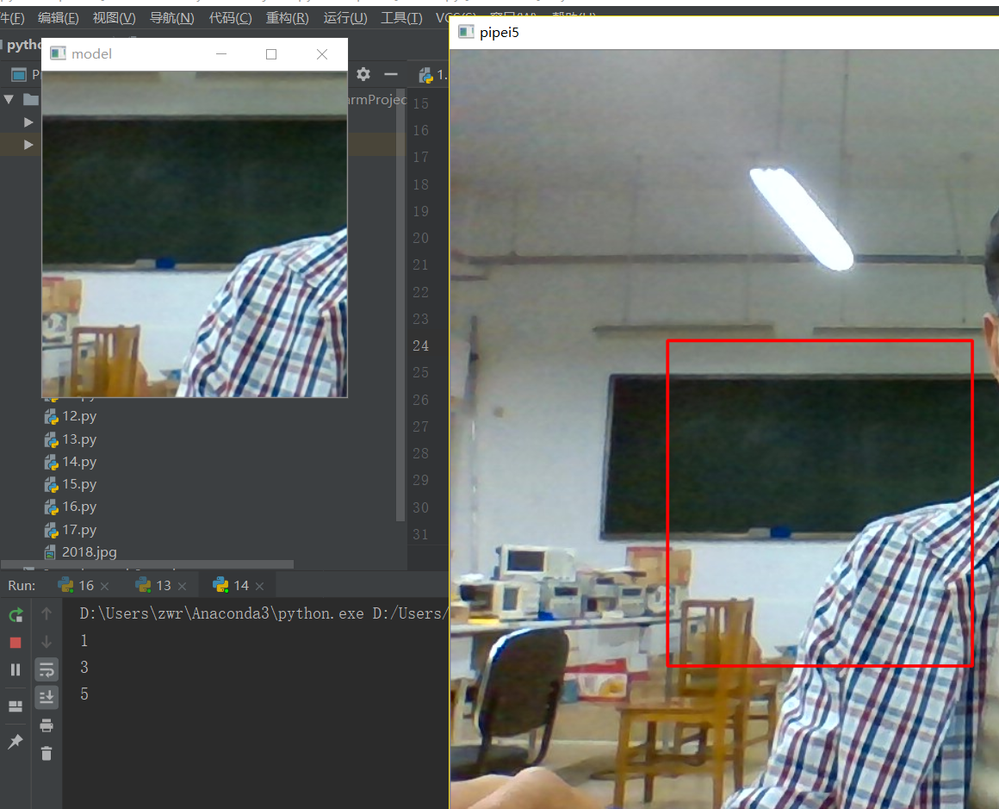
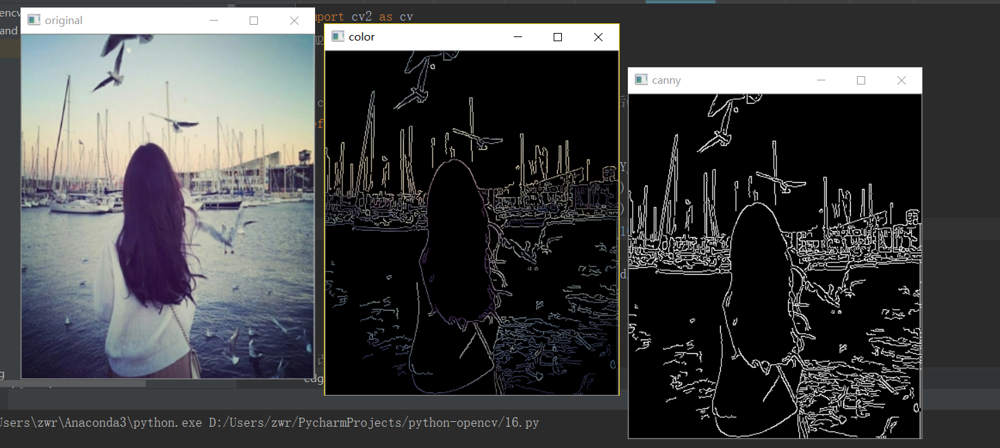
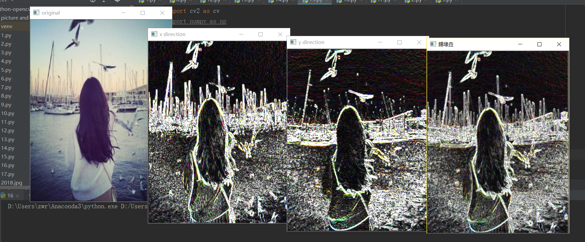
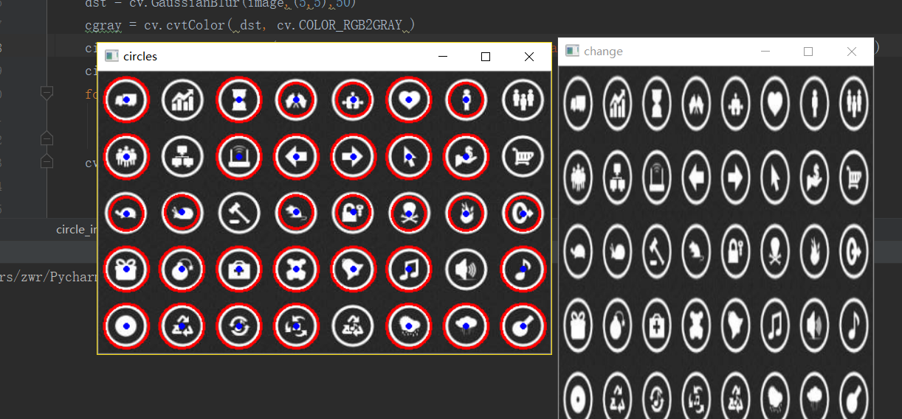
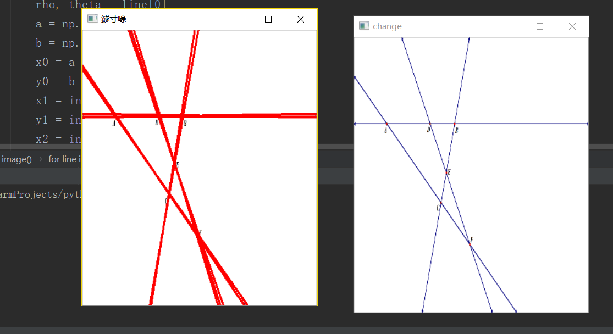
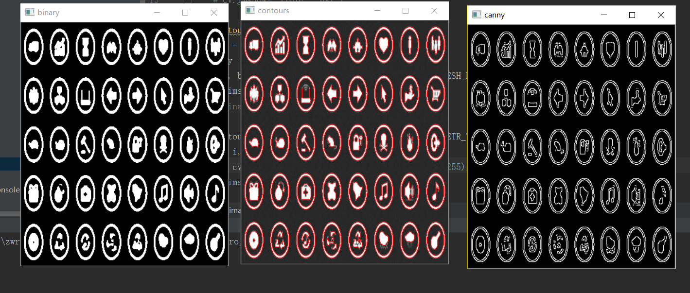
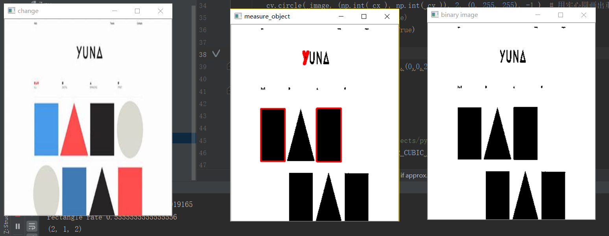
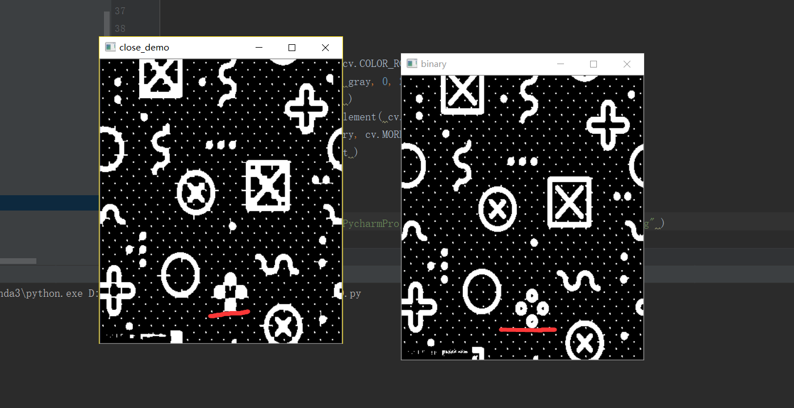
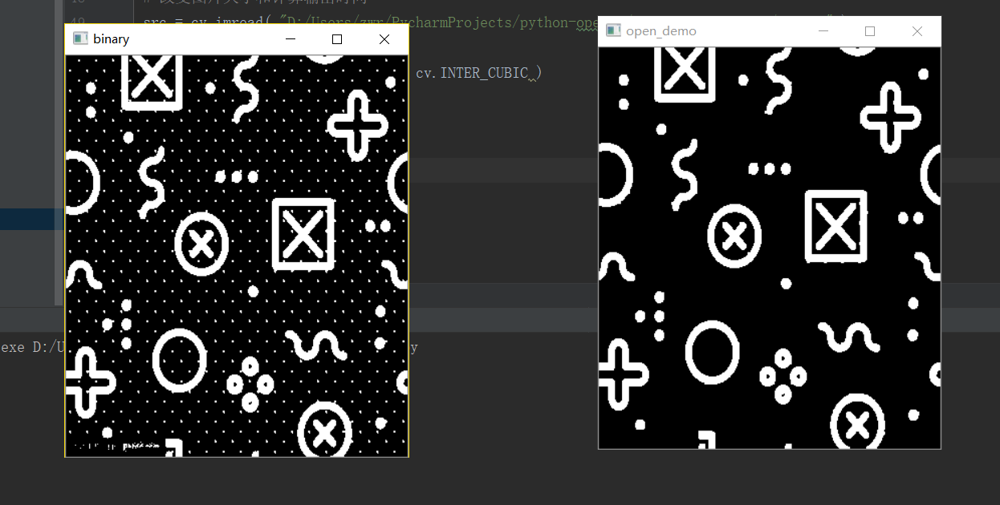

# Pyrhon3.7-opencv4.01
学习网站：https://www.bilibili.com/video/av24998616/?p=26

编程环境：pycharm
人脸检测的API包：haarcascade_frontalface_alt_tree.xml

13.py效果:

14.py效果:

15.py效果:

16.py效果:

17.py效果:

18.py效果:

19.py效果:

20.py效果:

