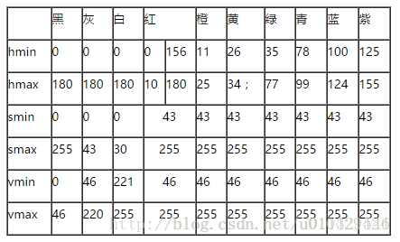

# Pyrhon3.7-opencv4.01
学习网站：https://www.bilibili.com/video/av24998616/?p=26

编程环境：pycharm
需要的一些库numpy opencv2 pytesseract matplotlib and so on
人脸检测的API包：haarcascade_frontalface_alt_tree.xml

概述与环境 1.py

图像和视频读取与保存 2.py

读出图像大小和通道 3.py

图像的加减乘除以及逻辑运算 4.py

对比度和亮度调节 5.py

图像截取和图像合成 6.py

图像填充以及ROI 7.py

图像模糊以及各种滤波 8.py

对比度和亮度调节 9.py

图像分通道分割和合并#图像平均以及方差# 色彩空间转换RGB->HSV 10.py

灰度图和直方图 11.py

二值化和局部图像处理和图像均值阈值 12.py

图像金字塔 13.py

模板匹配 14.py

图像梯度处理 15.py

边缘略波处理 16.py

霍夫变换以边缘检测 17.py

轮廓发现 18.py

对象测量 19.py

开闭操作 20.py

分水岭算法 21.py

人脸检测 22.py

数字验证码识别 23.py

色彩空间转化HSV时找颜色的阈值：

13.py效果:

14.py效果:

15.py效果:

16.py效果:

17.py效果:

18.py效果:

19.py效果:

20.py效果:

